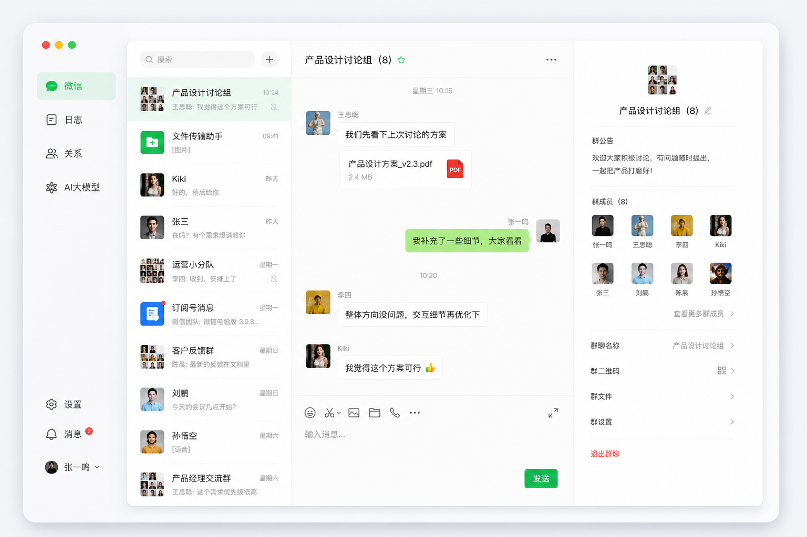
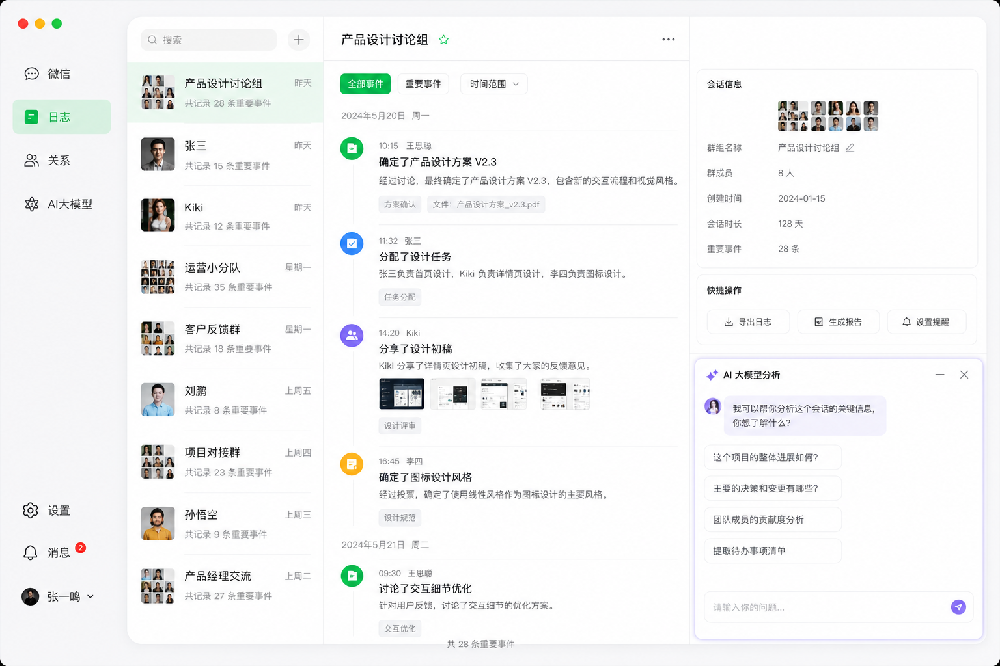
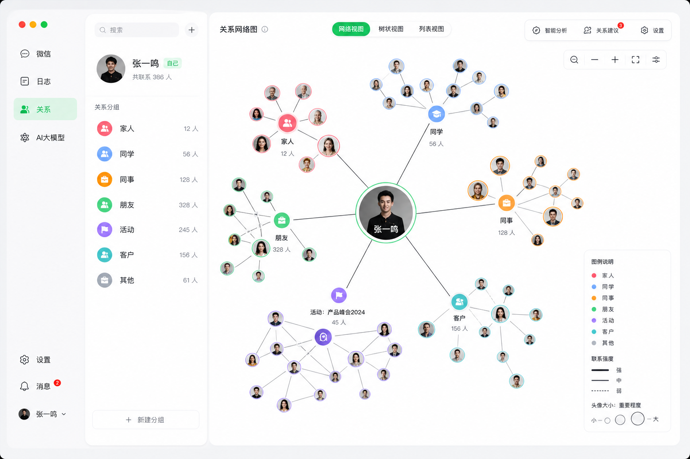

# WeLife

> 把你的微信聊天记录，变成可回溯的人生日志。

WeLife 是一款运行在本地的 macOS 桌面应用，基于你的微信聊天数据，帮助你回顾与每一个人的沟通历程、理解自己的社交关系网络，并借助 AI 洞察那些被遗忘的重要时刻。

**所有数据留在你自己的设备上，不上传，不同步。**

---

## 界面预览

### 微信聊天

完整还原微信聊天界面，支持搜索、历史记录浏览，只读模式，数据不离本机。



### 事件日志

自动将聊天记录结构化为「事件」，按天呈现你与每个人的互动时间线，右侧 AI 面板可对任意事件生成摘要或进行问答。



### 关系图谱

以力导向图可视化你的社交网络，节点大小代表互动强度，支持拖拽、缩放、点击查看联系人详情。



---

## 核心功能

| 模块 | 功能 | 状态 |
|------|------|------|
| **微信接入** | 自动同步最近会话与历史消息，每 60 秒增量更新 | ✅ V1 |
| **事件日志** | 按 30 分钟间隔自动切割事件，支持手动编辑、备注、合并 | ✅ V1 |
| **AI 分析** | 事件摘要、基于聊天上下文的问答，支持 Claude / GPT-4o / DeepSeek | ✅ V1 |
| **主题切换** | 浅色 / 深色模式，支持自定义背景图 | ✅ V1 |
| **关系图谱** | D3 力导向图，联系人互动评分，周互动趋势 | ✅ V2 |
| **情绪趋势** | 周 / 月互动报告，AI 关系分析 | 📋 V3 |

---

## 下载安装（推荐）

无需配置开发环境，直接下载安装包即可使用：

| 平台 | 下载链接 |
|------|----------|
| macOS（Apple Silicon / M 系列） | [WeLife-1.0.0-arm64.dmg](https://github.com/clover200301-afk/WeLife/releases/download/v1.0.0/WeLife-1.0.0-arm64.dmg) |
| macOS（Intel） | [WeLife-1.0.0.dmg](https://github.com/clover200301-afk/WeLife/releases/download/v1.0.0/WeLife-1.0.0.dmg) |

> **macOS 安装提示：** 首次打开时若提示「无法验证开发者」，请前往「系统设置 → 隐私与安全性」，找到 WeLife 并点击「仍要打开」。

也可以前往 [Releases 页面](https://github.com/clover200301-afk/WeLife/releases) 下载最新版本。

---

## 从源码运行

### 1. 克隆仓库

```bash
git clone git@github.com:clover200301-afk/WeLife.git
cd WeLife
```

### 2. 安装依赖

> Node.js >= 18 required

```bash
npm install
```

`postinstall` 脚本会自动编译 `better-sqlite3` 的 Electron 原生模块，无需手动操作。

### 3. 安装并登录 wechat-cli

WeLife 通过 [wechat-cli](https://github.com/yangzhao917/wechat-cli) 读取本地微信数据：

```bash
npm install -g wechat-cli
wechat-cli login        # 扫码登录，保持微信桌面版在前台运行
wechat-cli sessions     # 验证：能输出会话列表即表示连接成功
```

### 4. 启动应用

```bash
npm run dev
```

首次启动会进入引导页，按提示完成 wechat-cli 连接检测和 AI 配置（可跳过）即可进入主界���。

### 5. 配置 AI（可选）

在应用右下角「设置」页填入：

| 字段 | 说明 |
|------|------|
| API Key | 你的密钥 |
| Base URL | 如 `https://api.deepseek.com`（留空则默认 OpenAI）|
| 模型名 | 如 `deepseek-chat`、`gpt-4o`、`claude-opus-4-5` |

支持所有兼容 OpenAI 格式的接口，推荐 [DeepSeek](https://platform.deepseek.com)（性价比高）。

### 打包构建

```bash
npm run dist:mac:fast   # macOS Apple Silicon（推荐）
npm run dist:mac        # macOS 全架构
```

产物输出到 `release/` 目录。

---

## 技术栈

| 层级 | 技术 |
|------|------|
| 桌面壳 | Electron 34 + electron-vite |
| 前端 | React 19 + TypeScript + Tailwind CSS |
| 本地数据库 | SQLite（better-sqlite3） |
| 关系图谱 | D3-force |
| AI 调用 | HTTP API，用户自配，不内置 Key |
| 数据来源 | wechat-cli |

**本地优先原则：** 数据全部存储在 `~/.welife/` 目录下的 SQLite 文件中，不依赖任何云服务。

---

## 产品原则

- **人优先** — 所有 AI 结果均可编辑，不自动写入数据库
- **本地优先** — 无云同步，数据不离开用户设备
- **AI 辅助** — 不自动决策，用户确认后才保存

---

## 版本路线图

| 版本 | 状态 | 主要内容 |
|------|------|----------|
| V1 | ✅ 已完成 | 聊天展示、事件日志、AI 总结、引导页、主题切换 |
| V2 | ✅ 已完成 | 关系图谱、互动频率、联系人详情 |
| V3 | 📋 规划中 | 情绪趋势、周/月报告、AI 关系分析 |

---

## 加入种子用户群

扫码加入「回响」WeLife 种子群，第一时间获取更新、参与内测、反馈建议：


---

## 贡献者

<table>
  <tr>
    <td align="center" width="33%">
      <br />
      <strong>Clover</strong><br />
      <sub>全栈开发工程师</sub><br /><br />
      <sub>在日常生活中我们的微信聊天记录太多了，每天面对海量群消息，无法有效筛选，致使错过重要的事情。因此我们创造了它！</sub>
    </td>
    <td align="center" width="33%">
      <br />
      <strong>bananana</strong><br />
      <sub>产品经理</sub><br /><br />
      <sub>我们总在向前奔赴，却鲜少回头回望过往。于是便希望借由 AI 帮我们自动留存与回忆点滴瞬间。愿 WeLife 陪伴每一位步履忙碌、内心焦虑，却始终坚持自我成长的人。</sub>
    </td>
    <td align="center" width="33%">
      <br />
      <strong>Andrea</strong><br />
      <sub>设计师</sub><br /><br />
      <sub>Hello！我是 Andrea，WeLife 的设计师。这是我参与的第一个产品，希望它可以做大做强！加油加油！</sub>
    </td>
  </tr>
</table>

---

## License

MIT
