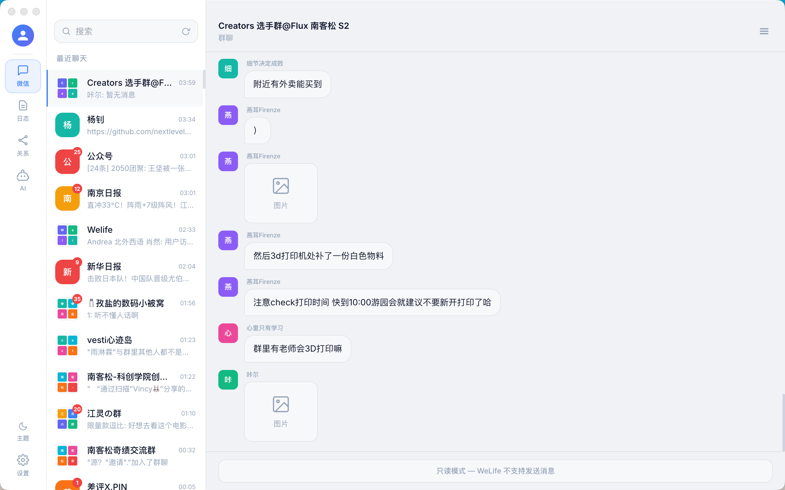
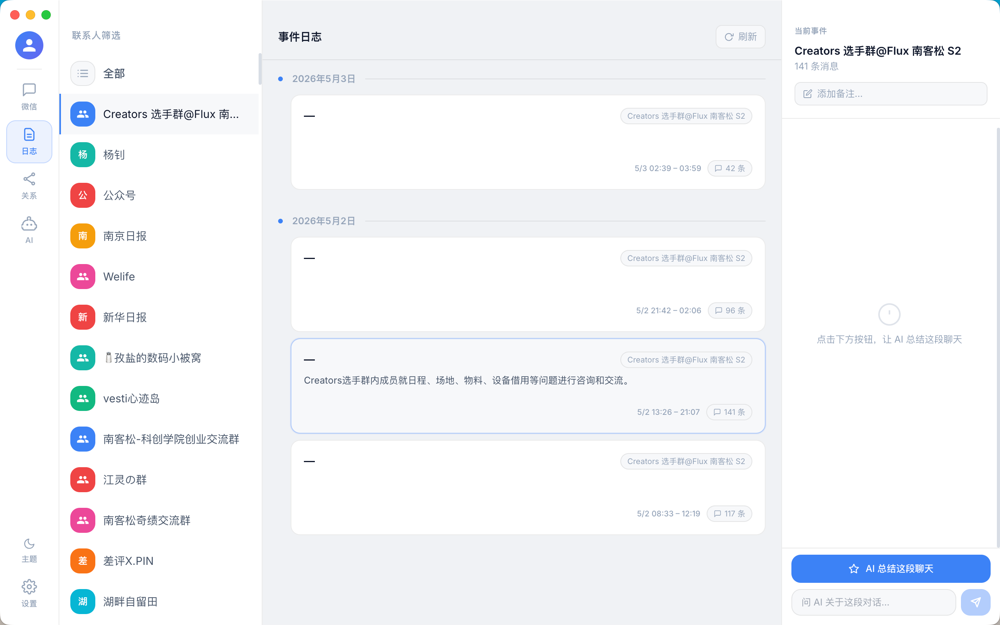
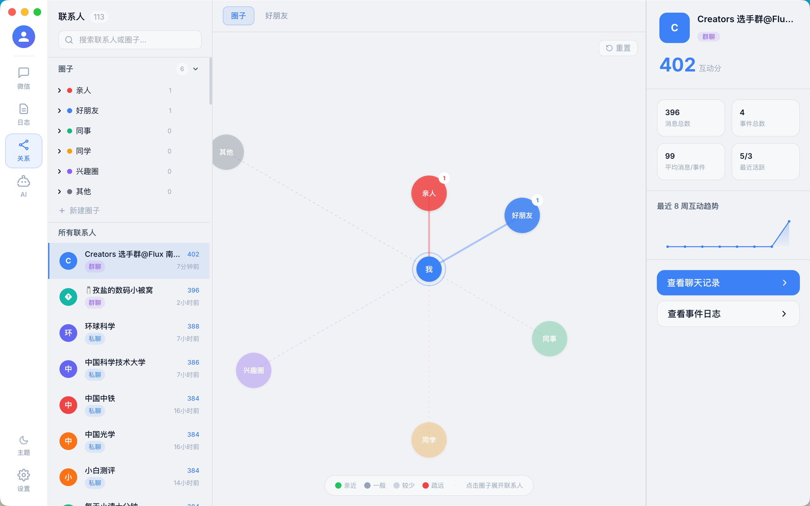
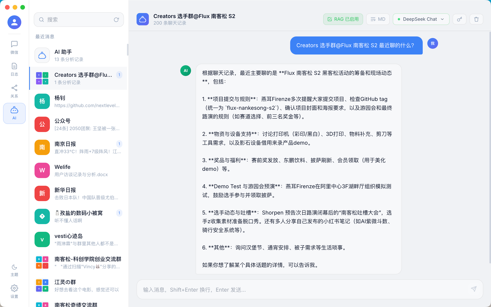
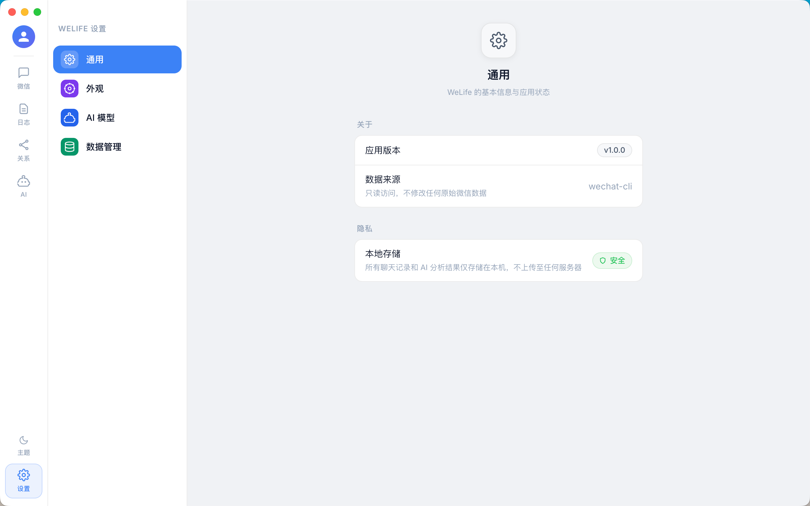

# WeLife — 让微信记忆有迹可循

> WeLife 是一款运行在本地的 macOS 桌面应用，将你的微信聊天记录转化为可检索的个人生活档案，并通过 AI 帮你读懂每一段对话背后的信息。

---

## 产品截图

| 页面 | 截图 |
|------|------|
| 聊天浏览 |  |
| 事件日志 |  |
| 关系图谱 |  |
| AI 助手 |  |
| 设置 |  |

---

## 核心功能

### 1. 微信聊天浏览

完整还原微信的聊天列表与消息界面。左侧栏展示所有联系人和群组，支持关键词搜索；右侧实时渲染聊天记录，图片、文字、系统消息均完整呈现。所有数据均来自��地 wechat-cli，**只读访问，不修改原始微信数据**。

**功能亮点：**
- 按最近活跃时间排序的会话列表，颜色头像区分联系人
- 消息支持滚动加载，流畅浏览完整历史
- 支持私聊与群聊，自动识别消息发送者

---

### 2. 事件日志（AI 驱动）

WeLife 不只是聊天记录查看器。它会将每段连续的对话切割成"事件"，并调用 AI 对每个事件进行结构化分析，自动提炼：

- **事件标题** — 十字以内概括这段对话在讲什么
- **内容摘要** — 一句话说清楚发生了什么
- **话题标签** — 自动识别讨论的核心话题
- **关键要点** — 提取信息密度最高的几条结论
- **情感倾向** — 积极 / 中性 / 消极 / 混合
- **待办事项** — 自动识别对话中提到的行动项
- **与我相关** — 标注哪些事件直接涉及自己

事件按日期归档，形成完整的个人生活流水账。右侧栏可直接发起 AI 问答，针对当前联系人的全部事件提问。

---

### 3. 社交关系图谱

将微信联系人可视化为力导向关系网络图。节点大小代表互动量，连线代表群组共现关系。左侧面板按圈子分类（亲人、好友、同事、同学、共同圈、其他），可筛选查看特定群体的关系网络。

选中某位联系人后，右侧面板展示：

- 总消息数、事件数、分析记录数
- 首次 / 最近联系日期
- 最近 8 周活跃度趋势折线图
- 快捷入口：查看聊天记录、查看事件日志

---

### 4. AI 智能问答（RAG 模式）

AI 页面是 WeLife 的核心。它不是普通的 AI 对话框，而是以你的微信数据为知识库的**私人记忆助手**。

**三种知识源模式：**

| 模式 | 知识库内容 | 适用场景 |
|------|-----------|---------|
| 聊天记录 | 最近 200 条原始消息 | 询问具体说了什么、找某个内容 |
| 事件分析 | AI 生成的结构化事件摘要 | 询问某段时间发生了什么 |
| 两者结合 | 消息 + 分析同时注入 | 综合性问题 |

每次对话前，系统自动将对应数据拼装为上下文注入到 AI，实现真正的检索增强生成（RAG）。页面顶部的标签实时显示当前模式（`RAG 已就绪` / `MG`）和所用模型。

**支持多模型配置：**
- 内置 DeepSeek、OpenAI、自定义 base_url 等主流接口
- 可为每个模型单独配置 API Key 和 base_url
- 支持流式输出，回答实时逐字呈现

---

### 5. 设置中心

设置分为四个模块：

| 模块 | 功能 |
|------|------|
| **通用** | 查看应用版本、数据来源、隐私说明 |
| **外观** | 切换深色 / 浅色主题 |
| **AI 模型** | 配置 base_url、API Key、默认模型，以及 RAG 各模式的 System Prompt |
| **数据管理** | 导入、清空本地数据 |

---

## 隐私与安全

WeLife 遵循严格的本地优先原则：

- **数据不离机** — 所有聊天记录、AI 分析结果均存储在本地 SQLite 数据库（`~/Library/Application Support/WeLife/welife.db`），不上传至任何服务器
- **只读数据源** — 通过 wechat-cli 读取微信数据库，不写入、不修改原始微信数据
- **API Key 加密存储** — 使用 Electron safeStorage（底层调用 macOS Keychain / Windows DPAPI）对所有 API Key 进行系统级加密，数据库中存储的是密文而非明文
- **网络请求最小化** — 仅在用户主动触发 AI 功能时向配置的模型接口发送请求，且请求内容由用户完全掌控

---

## 技术栈

| 层 | 技术 |
|----|------|
| 桌面框架 | Electron + Vite |
| 前端 | React + TypeScript |
| 本地数据库 | SQLite（better-sqlite3） |
| AI 接入 | 兼容 OpenAI API 格式的任意模型（DeepSeek、OpenAI 等） |
| 数据来源 | wechat-cli（只读） |

---

## 快速开始

```bash
# 克隆仓库
git clone https://github.com/clover200301-afk/WeLife.git
cd WeLife

# 安装依赖
npm install

# 开发模式
npm run dev

# 打包
npm run build
```

首次启动需要在 **设置 → AI 模型** ���配置你的 AI 接口地址和 API Key，然后在 **设置 → 数据管理** 中导入微信数据即可开始使用。
